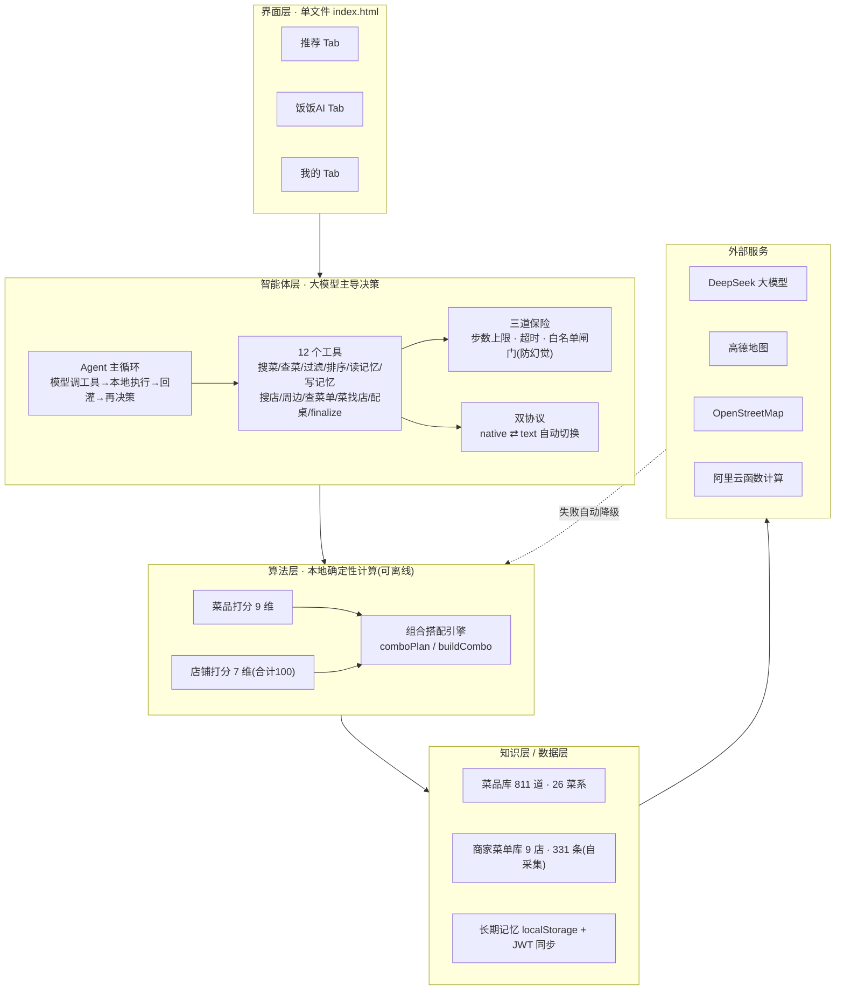

# 饭饭AI —— 介绍与答辩材料

> 参赛作品：饭饭AI ｜ 作品形态：HTML5 单文件网页应用（手机浏览器打开即用）
> 作者：郑崇明团队 ｜ 赛道：计算机应用大赛 · 大模型与智能体应用
> 本文档包含三部分：① 完整技术分析 ② 3 分钟介绍稿（口播版） ③ 技术架构图

> ⚠️ **数据时效提示**：本文档生成于 2026-09-29，正文里的部分数字已过时，引用前请核对当前代码：
> - 菜品库：文内「811 道 / 26 菜系」→ 当前 **2265 道**
> - 商家菜单库：文内「9 家店 331 条」→ 当前 **62 家档口（食堂），menu 1569 品项**
> - 主程序：文内「8995 行 / 642 KB」→ 当前 index.html 约 8824 行（数据层已抽到 `data/db.js`）
> - 其余（12 个 Agent 工具、9 维菜品打分、7 维店铺打分、双协议、防幻觉白名单等架构）未变，仍准确。

---

## 目录

- [Part A · 完整技术分析](#part-a--完整技术分析)
- [Part B · 3 分钟介绍稿（口播版）](#part-b--3-分钟介绍稿口播版)
- [Part C · 技术架构图](#part-c--技术架构图)

---

# Part A · 完整技术分析

## 一、一句话定位

> **饭饭AI 是一个「今天吃什么」的智能体网页应用：本地确定性算法负责「算得准」，大模型智能体（12 个工具 + 防幻觉白名单）负责「听得懂、会决策」，高德/OpenStreetMap 实时数据负责「吃得到」。单文件纯前端，手机浏览器打开即用，无框架、无依赖、可离线。**

**作品形态**：HTML5 单文件（`index.html`，约 642 KB / 8995 行），非 App、非小程序、非前后端分离项目。

---

## 二、解决的痛点与产品结构（三大板块）

| 板块 | 作用 | 核心技术 |
|---|---|---|
| **① 推荐** | 选预算档 + 类型 + 一句话 → 配出「一桌菜」+ 真实店铺 | 9 维打分 + Agent 工具链 + 高德实时搜店 |
| **② 饭饭AI** | 专聊中国饮食文化的对话智能体 + 今日推荐 + 根据聊天推荐菜 | LLM 对话 + 聊天意图解析 |
| **③ 我的** | 长期记忆：忌口、口味、点赞点踩、吃过记录 | localStorage + 后端账号跨设备同步 |

**关键产品创新**：不是推荐「一道菜」，而是**配「一桌菜」**（一荤一素＋主食，按档位加汤/饮品），且整桌必须**能在同一家真实店铺一次点齐**。

---

## 三、技术栈全景（评委问「用了什么技术栈」这样答）

诚实版：饭饭AI 是**纯原生技术栈**，分层如下：

| 层 | 用的技术 |
|---|---|
| 前端 | **原生 HTML5 + CSS3 + JavaScript (ES6+)**，单文件，**无框架、无构建、无 npm 依赖** |
| 大模型 | **DeepSeek**（主），兼容 OpenAI 格式接口；**Function Calling** 工具调用 |
| 地图/位置 | **高德地图 Web 服务 API**（搜索/地理编码/逆编码）+ **OpenStreetMap Overpass**（兜底）+ 浏览器 Geolocation + **haversine** 距离公式 |
| 后端 | **阿里云函数计算**（Serverless）+ REST API + **JWT** 鉴权 |
| 托管 | **GitHub Pages**（静态托管演示地址） |
| 数据 | JSON（内嵌 + 外部文件）+ **localStorage**，无数据库 |
| 工程化 | **Node.js 脚本**（41 个开发脚本，仅开发用）+ 自建测试（506 条断言）|

**核心话术（把「没框架」讲成优势）**：

> 「我们**刻意没有用 React / Vue 这类框架，也没有任何 npm 依赖**。原因有三：一是**可离线运行**——断网、没额度时自动退回本地算法引擎；二是**可长期运行**——不依赖任何第三方库的版本，评委多年后再打开这个文件依然能跑，不会出现依赖过期打不开的情况；三是**可完整审计**——全部逻辑在一个文件里，没有藏在依赖里的代码。这是针对『参赛/评奖作品』这个场景做的明确取舍。」

> 「所以如果按『用了什么框架』来问，答案是**原生技术栈**；但如果按『技术含量在哪』来问，它不在框架上，而在我们自己搭的三层架构里：**Agent 智能体层（12 工具 + 防幻觉白名单）、确定性打分算法（9 维）、以及数据流水线（实拍→OCR→大模型→人工核对）**。这些才是这个作品真正的技术核心。」

**如果追问「没框架是不是技术含量低？」**：

> 「恰恰相反，用框架在这里是**负优化**。框架和构建工具需要打包、需要服务器或 CDN 加载运行时，会破坏我们『打开即用、离线可用、多年后可运行』这三个目标。我们的技术难点不在『把组件拼起来』，而在：**怎么让大模型自己动手查工具而不编造数据（白名单闸门）、怎么在没有大模型时依然推荐得准（确定性算法）、怎么把到店实拍的照片变成结构化菜单（OCR 流水线）**——这些用不用框架都一样难，反而纯原生更能体现工程能力。」

**追问一句话应对**：

| 追问 | 应对 |
|---|---|
| 后端用什么框架写的？ | 阿里云函数计算（Serverless），函数即服务；前端只通过 REST 接口交互 |
| 为什么不用小程序/App？ | 网页打开即用，零安装、零门槛，评委扫码即用；跨 iOS/安卓/微信浏览器 |
| 测试怎么做的？ | 自建 41 个 Node 脚本，506 条断言，覆盖组合逻辑、标签、Agent、定位、端到端真连大模型和地图 |

---

## 四、技术架构（分层）

```
┌─────────────────────────────────────────────┐
│  界面层：单文件 HTML5 + 内联 CSS（手机优先，三 Tab）  │
├─────────────────────────────────────────────┤
│  智能体层：Agent 主循环 + 12 工具 + 防幻觉白名单闸门    │
│  算法层：9 维菜品打分 + 7 维店铺打分 + 组合搭配引擎     │
│  知识层：811 道菜 / 26 菜系 / 商家菜单库（自采集）      │
│  数据层：localStorage 长期记忆 + JWT 账号同步        │
├─────────────────────────────────────────────┤
│  外部服务：DeepSeek / 高德 / OpenStreetMap / 阿里云FC │
└─────────────────────────────────────────────┘
```

### 1. 形态选择（有意识的设计决策，答辩主动讲）

源码说明里明确写了**为什么是单文件纯前端**，这是评委爱问的点：

- **可离线运行**：断网/无 Key/额度用尽时，自动退回本地算法引擎，功能不中断；
- **可长期运行**：零第三方依赖（不引用任何外部 script/link/img，无 jQuery/React/Vue），评委多年后再打开仍能跑；
- **可完整审计**：全部逻辑在一个文件里，无「藏在依赖里」的代码。

> 代价是单文件大、维护需自律（有 `标签规范.md` 约束），团队认为收益大于代价——**这是可以被挑战、但你们有完整论证的点**。

### 2. 知识库（结构化数据）

- **菜品知识库 811 道、26 菜系**（鲁川粤苏浙闽湘徽 + 家常/日式/韩式/东南亚/西北/健康轻食/火锅/烧烤等）
- 每道菜字段：`id / 菜名 / 类别(rice|noodle|other) / 角色(main|single|side|staple|soup|drink) / 菜系 / 参考价 / 辣度 / 口味标签 / 致敏食材 / 描述`
- **三层标签体系**（原创亮点）：界面标签 → 关键词 → 菜品标签 的三层映射，让「口语」能落到「结构化菜」
- **商家菜单库**：9 家店、331 条菜单记录，**到店实拍 → OCR → 大模型整理 → 人工核对**自采集

### 3. 本地推荐算法（确定性计算，9 维打分）

`scoreDish()` 的 9 个维度（「关掉大模型也能用」的底气）：

| 维度 | 权重 | 说明 |
|---|---|---|
| 预算匹配 | 26 | 是否落在档位区间内 |
| 档位调性 | 8 | 吃好饭要「值得」，小饭要「快」 |
| 今日想吃 | 26 | 标签 + 自由文本命中 |
| 口味画像 | 22 | 长期喜好 + 历史点赞/点踩 |
| 辣度适配 | 8 | 超辣度上限强扣分 |
| 时段契合 | 12 | 早/午/晚/夜 时段需求 |
| 新鲜感 | 10 | 7 天内吃过降权（换点新鲜的）|
| 大众口碑 | 6 | 热度 |
| 随机探索 | 3 | 让「换一批」有变化 |

店铺打分 7 维合计 100 分：**距离 20 / 人均匹配 18 / 评分 16 / 菜系对口 14 / 菜品覆盖 16 / 口味契合 10 / 方式匹配 6**。

**硬约束（三步过三关）**：忌口过滤 → 预算上限 → 这家店做不做得了这道菜（以真实菜单为准）。

### 4. 智能体层（大模型主导决策 —— 作品核心创新）

**12 个工具**（`AGENT_TOOLS`，function calling）：

```
search_dishes（搜菜）      get_dish（菜详情）      filter_dishes（硬规则过滤）
rank_dishes（多维排序）    get_profile（读记忆）   remember（写记忆）
search_shops（搜真实店）   get_nearby（周边店）    get_shop_menu（查真实菜单·批量）
list_shops_for_dish（菜找店） build_combo（配一桌） finalize（提交方案）
```

**Agent 主循环**：模型说调哪个工具 → 本地真实执行 → 结果回灌 → 模型再想 → …… → `finalize` 收尾。**决策权在大模型手里，但每一步都是真实计算**，所以编不出库里没有的菜、报不出没查过的店。

**三道保险**（防幻觉、防失控，答辩重点讲）：
1. **步数上限** `AGENT_MAX_STEPS`（并设「步数将尽」提醒，宁可交不完美方案也不无限查）
2. **单步超时**
3. **finalize 白名单闸门**：提交方案时，`shop_id` 和每个 `dish_id` 必须是前面工具**真实返回过**的 id，否则驳回并给出「下一步怎么做」的提示——这是防大模型幻觉的核心机制

**双协议自适应**（工程细节，体现功力）：
- `native` 协议：直连 DeepSeek，标准 function calling；
- `text` 协议：后端代理会「吞掉」tools 参数时，把工具清单写进提示词，让模型只回一行 JSON，本地解析还原成 tool_calls；
- 自动探测 + 自动切换（`ensureAgentChannel` / `agentRun` 自纠错），用户无感。

### 5. 大模型接入（三处分工明确）

| 角色 | 位置 | 作用 |
|---|---|---|
| ②b 听懂 | 「用一句话说说」解析 | 口语 → 标签 + 关键词（词表外说法也能解析）|
| ⑨ 说话 | 推荐结果润色 | 把算好的一桌菜写成自然推荐语 |
| Agent 决策 | 主导选菜/选店流程 | 通过 12 个工具自主决策 |

支持 DeepSeek / OpenAI / 自定义 OpenAI 兼容接口，**失败自动降级**（关大模型功能一个不少，只是退回本地词表）。口味解析缓存 7 天不重复调模型。

### 6. 地图与真实店铺（「吃得到」的保障）

- **高德 Web 服务 API**：搜真实店、地址解析、逆地理编码；`haversine` 按经纬度实算距离
- **OpenStreetMap Overpass API**：高德不可用时的免费兜底
- **「店为先」策略**（2026-09 重构）：多菜 → 意图 → 最多 6 个搜店关键词 → 周边搜索 → 反查「每家店能做哪些候选菜」→ 打分排序
- **配额优化**：一次推荐仅 2~4 个高德请求（原 11 个），关键词/周边/地理编码全缓存，配额可见
- 浏览器 GPS 定位 → 逆地理编码，城市不一致自动切换，任何城市都能现场加项

### 7. 后端与账号（阿里云函数计算，自建）

- 接口：`/api/llm`、`/api/amap`（密钥留服务端）、`/api/register|login`（JWT）、`/api/profile|settings`（跨设备同步）
- **两条底线**（有测试兜底）：后端挂了 → 回退本机直连；后端 Key 失效 → 自动切换本机 Key

---

## 五、数据存储与用户个人数据

### 5.1 数据库用的是什么？

**没有使用任何传统数据库**（无 MySQL / SQLite / MongoDB / IndexedDB / WebSQL）。数据存了四层：

| 层 | 存储方式 | 存什么 | 位置 |
|---|---|---|---|
| **① 内嵌 JSON 常量** | JS 数组/对象（硬编码在 index.html 里） | 菜品库 811 道、商家菜单库 9 店 331 条、标签/城市/忌口表 | `const DISHES = [...]`、`const SHOP_DB_BUILTIN = {...}` |
| **② 外部 JSON 文件** | 运行时可 fetch，fetch 不到就用①的内嵌快照 | 商家菜单库、入库流水账、菜单源文件 | `02-数据与知识库/shops.json`、`新菜记录.json`、`菜单源文件/*.json` |
| **③ localStorage** | 浏览器本地键值存储 | 长期记忆、口味画像、忌口、设置、聊天记录、高德缓存 | `eatAgent.profile.v1`、`eatAgent.settings.v1`、`eatAgent.ai.v1`、`ff_amap_cache_v1` 等 |
| **④ 后端阿里云 FC** | REST API（JWT 鉴权） | 账号 + 口味/设置跨设备同步 | 前端只通过 `/api/profile`、`/api/settings` 等 HTTP 接口交互 |

### 5.2 用户的个人数据究竟存在哪里？

**默认 100% 存在用户自己的浏览器 localStorage（本机）里，只有登录后，「口味画像」和「设置」才同步一份到后端云端。**

**默认全部存本机（不登录）**——所有个人数据都写进浏览器 `localStorage`：

| localStorage 键 | 存什么 |
|---|---|
| `eatAgent.profile.v1` | **口味画像**：忌口(11项)、口味偏好(12项)、吃辣程度、点赞/点踩、**吃过的历史记录**、AI 记忆条目、被屏蔽的推荐 |
| `eatAgent.settings.v1` | 设置：模型/服务商、默认预算档、城市、联网开关等 |
| `eatAgent.ai.v1` | **聊天记录** + 今日推荐 + 菜品讲解缓存 |
| `eatAgent.craveparse.v1` | 「一句话说说」的解析缓存（同一句话 7 天不重复调模型） |
| `eatAgent.token.v1` | 登录后的 JWT 凭证 |
| `eatAgent.identity.v1` | 当前身份（游客 / 已登录用户名） |
| `ff_amap_cache_v1` | 高德搜索/地理编码缓存 |

**登录后，只有两样同步到后端（阿里云 FC）**：

| 接口 | 同步内容 | 目的 |
|---|---|---|
| `PUT /api/profile` | 整个 `state.profile` 对象（忌口、口味、点赞点踩、吃过记录等） | 跨设备同步口味画像 |
| `PUT /api/settings` | 整个 `state.settings` 对象 | 跨设备同步设置 |

**明确永不上云的三类数据（代码里有硬性保证）**：

1. **密钥**：大模型 Key、高德 Key、后端地址——`pullServerData()` 里保留本机值，服务端不存也不覆盖；
2. **聊天记录**：`eatAgent.ai.v1` 只有 localStorage，没有对应的后端接口；
3. **记忆条目本机优先**：登录拉取时不会被服务端空值覆盖。

---

## 六、代码结构（8995 行怎么组织的）

- **HTML**：3 个 Tab 页（推荐/饭饭AI/我的）+ 底部弹层（定位、菜品详情等）
- **CSS**：全部内联，手机优先，含手绘内联 SVG 角色「饭饭」（不用 emoji，跨设备统一）
- **JS 核心模块**（按出现顺序）：
  - 数据配置：`TIERS / CATS / DISHES(811) / SHOP_DB / CITIES / 标签体系`
  - 本地存储：`loadStore / saveProfile / saveSettings`
  - 后端：`apiCall / syncToServer / loginOrRegister / serverSelfCheck`
  - 商家库：`buildShopDbIndex / dbShopFor / cuisineRefFor`（4 层作用域）
  - 地图：`amapFetch / resolveLocation / amapSearchByKeyword / osmAround`
  - 打分：`scoreDish`（9 维）/ `scoreRestaurant`（7 维）/ `restaurantServes`
  - 组合：`comboPlan / buildCombo`（口径统一）
  - **Agent**：`AGENT_TOOLS(12) / runTool / agentRun / agentRunWith / toolFinalize`
  - 聊天：`aiSystemPrompt / aiSend / aiIntentPrompt / aiLocalIntent`

---

## 七、数据规模一览（引用时要能脱口而出）

| 项目 | 数量 |
|---|---|
| 主程序 | 1 文件 / 约 642 KB / 8995 行 |
| 菜品知识库 | 811 道菜、26 菜系 |
| 商家菜单库 | 9 家店、331 条菜单记录 |
| Agent 工具 | 12 个 |
| 开发/验证脚本 | 41 个 |
| 本地测试断言 | 506 条 |
| 忌口/口味/标签 | 11 项忌口、12 个口味、40 个「今日想吃」标签 |

**工程化配套**（`03-开发脚本`）：15 个回归测试 + 4 个静态体检 + 6 个端到端验证（真连 DeepSeek/高德/OSM）+ 数据流水线（OCR 批量入库）。

---

## 八、答辩高频问题 + 回答要点

**Q1：大模型在整个系统里到底起什么作用？关掉它能用吗？**
→ 三个角色分工（听懂/说话/决策）。**决策算法是确定性的本地计算**，关掉大模型功能一个不少，只是退回本地词表匹配、少一段润色文案。这是「可靠性优先」的设计。

**Q2：怎么防止大模型「编」出一道菜或一家店？**
→ 三层：① 工具只返回真实存在的 id；② `finalize` 白名单闸门（没被工具返回过的 id 直接驳回）；③ 商家菜单库把「这家店做不做得了」从猜测变成事实。所以模型**编不出库里没有的菜、报不出没查过的店**。

**Q3：为什么不用 React/Vue/框架？为什么单文件？**
→ 三个收益：离线可用、长期可运行、可完整审计。对一个参赛/评奖作品，评委最怕「依赖过期打不开」和「代码藏在依赖里」。这是有意识的选择，代价（维护需自律）用 `标签规范.md` 和静态体检脚本兜住。

**Q4：数据从哪来的？**
→ 菜品库人工结构化整理；商家菜单是**到店实拍 → OCR（Windows 自带，带坐标）→ 大模型整理 → 人工逐条核对**。不内置任何编造的示例饭店（原先有一份已整份删除），店铺全联网实时检索。

**Q5：隐私和账号怎么做？**
→ 不登录一切只存本机 localStorage；登录后口味画像和设置同步到后端（跨设备前提），密钥留服务端，JWT 鉴权。

**Q6：Agent 走的是标准 function calling 吗？**
→ 准备了两种协议（native / text）并自动探测切换。因为后端代理曾「吞掉」tools 参数，text 协议用 JSON 文本模拟工具调用，主循环共用。这是真实工程里踩坑后的设计。

**Q7：推荐的「可解释性」在哪？**
→ 每个打分维度都有 `reasons`，结果卡片标数据来源（高德实时/OSM/自采集菜单），「附近这些店也能做」列表显示每家店能做几道你想吃的。

**Q8：有什么没做到的 / 未来计划？**
→ 作品简介里已写：后续引入食谱、地图、定制饮食计划、「和家人一起用」。答辩时主动说「边界」比硬撑好。

**Q9：数据库用的什么？**
→ 没有传统数据库。结构化数据是内嵌/外部 JSON，用户数据在 localStorage，登录后画像同步到后端 REST 接口。这是「内嵌 JSON + localStorage + 轻量后端 API」三层方案，而不是 SQL 数据库（详见 Part A 第五节）。

**Q10：用的什么技术栈？**
→ 原生技术栈：原生 HTML5+CSS3+JS，无框架无依赖；大模型接 DeepSeek（Function Calling）；地图接高德+OSM；后端阿里云函数计算+JWT；工程化靠 41 个 Node 脚本+506 条断言。技术含量在自建的 Agent 架构、打分算法和数据流水线，而不在框架上（详见 Part A 第三节）。

**Q11：用户的个人数据存在哪里？**
→ 默认全部只存用户手机的浏览器 localStorage，不上传服务器；只有登录后，「口味画像」和「设置」才同步到后端用于跨设备同步。密钥、聊天记录、记忆条目永远留本机（详见 Part A 第五节）。

---

# Part B · 3 分钟介绍稿（口播版）

> 约 760 字，按中文正式演讲 230~250 字/分钟，正好 3 分钟。分段即停顿，可直接背诵。

**【开场 · 30 秒】** 各位评委老师好，我们带来的作品叫「饭饭AI」——一个解决「今天吃什么」的智能体网页应用。它不是 App，也不是小程序，而是**一个单文件、纯前端、手机浏览器打开即用的 HTML5 应用**。你只需要选一下预算档位、类型，再用一句话说「想吃点辣的、有汤的」，它就能帮你**配出一整桌菜**——一荤一素加主食，还要告诉你，附近哪家真实的店能一次把这些菜都点齐。

**【产品三大板块 · 40 秒】** 应用分成三个板块。第一是「推荐」，这是核心；第二是「饭饭AI」，一个专门聊中国饮食文化的对话智能体，还能根据聊天记录反推你今天想吃什么；第三是「我的」，管长期记忆——忌口、口味、点赞点踩、每天吃过什么，越用越懂你。

**【技术核心 · 90 秒】** 技术上，我们最想讲三点。

第一，**大模型不是「张嘴就答」，而是自己动手查**。我们给大模型做了 12 个工具，让它通过 function calling 一轮轮地读记忆、搜菜、搜店、查菜单、配桌、最后定案。每一步都是真实的本地计算，所以它编不出库里没有的菜，也报不出没查过的店。

第二，**防幻觉的白名单闸门**。大模型提交最终方案时，每一个菜的 ID、每一家店的 ID，都必须是前面工具真实返回过的，否则直接驳回。这是让「智能体决策」变得可信的关键。

第三，**可离线、可降级的本地算法引擎**。底层是一套 9 个维度的确定性打分算法——预算、口味、辣度、时段、新鲜感等等，关掉大模型、断网、没额度，功能一个不少。我们接入了高德地图实时搜真实的店，高德不可用就自动退回 OpenStreetMap。

**【数据与工程 · 40 秒】** 数据上，菜品库是 811 道菜、26 个菜系，商家菜单是我们到店实拍、OCR 识别、人工核对来的。整个项目 8995 行代码、41 个开发脚本、506 条自动化测试断言，没有引用任何第三方开源库。

**【收尾 · 20 秒】** 饭饭AI 把「大模型的听懂、会决策」和「本地算法的算得准、靠得住」结合起来，让推荐不仅能听懂人话，更真的能吃到嘴里。谢谢各位老师，请老师们指正。

---

# Part C · 技术架构图

## 方式一：ASCII 文本图（可直接粘进 Word / PPT）

```
┌──────────────────────────────────────────────────────────────┐
│                        界面层（单文件 index.html）              │
│    推荐 Tab  ｜  饭饭AI Tab  ｜  我的 Tab   ｜  底部弹层          │
│              （内联 CSS 手机优先 + 内联 SVG 角色「饭饭」）          │
└──────────────────────────────┬───────────────────────────────┘
                               │
┌──────────────────────────────▼───────────────────────────────┐
│                 智能体层（大模型主导决策）                        │
│   Agent 主循环：模型调工具 → 本地执行 → 结果回灌 → 再决策         │
│   ┌─────────────────────────────────────────────────────┐     │
│   │ 12 个工具（function calling）                        │     │
│   │ 搜菜/查菜/过滤/排序/读记忆/写记忆/搜店/周边/查菜单/      │     │
│   │ 菜找店/配桌/finalize                                 │     │
│   └─────────────────────────────────────────────────────┘     │
│   三道保险：步数上限 · 单步超时 · finalize 白名单闸门（防幻觉）    │
│   双协议：native function calling ⇄ text JSON（自动切换）       │
└──────────────────────────────┬───────────────────────────────┘
                               │
┌──────────────────────────────▼───────────────────────────────┐
│            算法层（本地确定性计算，可离线）                        │
│   菜品打分 9 维：预算26 调性8 想吃26 画像22 辣度8 时段12          │
│                 新鲜感10 口碑6 探索3                            │
│   店铺打分 7 维（合计100）：距离20 人均18 评分16 菜系14           │
│                 覆盖16 口味10 方式6                             │
│   组合搭配引擎 comboPlan / buildCombo（一桌菜，口径统一）         │
│   硬约束：忌口 → 预算上限 → 店做不做得了                         │
└──────────────────────────────┬───────────────────────────────┘
                               │
┌──────────────────────────────▼───────────────────────────────┐
│            知识层 / 数据层（结构化数据）                          │
│   菜品知识库 811 道 · 26 菜系（三层标签体系）                     │
│   商家菜单库 9 店 · 331 条（自采集：实拍→OCR→大模型→人工核对）      │
│   localStorage 长期记忆（忌口/口味/点赞点踩/历史）                │
│   JWT 账号 + 跨设备同步                                        │
└──────────────────────────────┬───────────────────────────────┘
                               │
┌──────────────────────────────▼───────────────────────────────┐
│                   外部服务（接口调用，非代码引用）                  │
│   DeepSeek 大模型 ｜ 高德 Web 服务 ｜ OpenStreetMap ｜ 阿里云FC  │
│   （失败自动降级 / 缓存 / 配额优化 / 密钥留服务端）                 │
└──────────────────────────────────────────────────────────────┘
```

## 方式二：Mermaid 图（在 Typora / VS Code / GitHub 里直接渲染成图片）



---

*文档生成时间：2026-09-29 ｜ 依据：源码说明、README、软件设计文档、主程序 index.html 核心代码*
*（由 file-history 恢复，2026-10-03 落盘到本仓库；顶部已附数据时效提示）*
